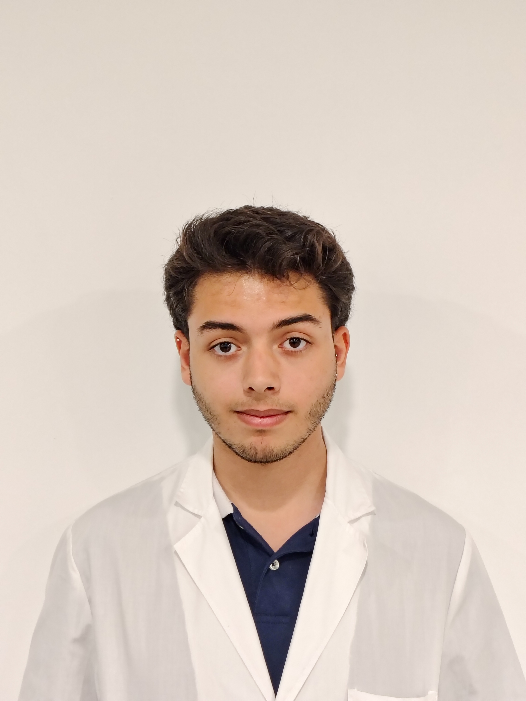

# 🧬 About / Sobre Nosotros

  

  

    

      
About

    

  

> *Transforming biological complexity into clear, data-driven insight.*

**TH BioData Consulting** is a data science and bioinformatics consulting firm founded by **Tiago Alejo Herrador**, dedicated to transforming biological complexity into clear, reproducible, and actionable insights.  
We bridge the gap between **biology, data, and technology**, providing customized computational solutions for research and industry.

---

## 🌍 🇬🇧 English Version

### Who We Are
TH BioData Consulting integrates biological research with modern data science.  
Our mission is to make biological and environmental data **accessible, interpretable, and scientifically robust**, empowering researchers and organizations to make better decisions through quantitative analysis.

### What We Do
We develop **Python-based analytical tools and workflows** for:
- Image analysis and plant pathology.  
- Omics data processing and bioinformatics modeling.  
- Geospatial and ecological data extraction.  
- Automated pipelines and reproducible research.  

### Our Approach
We believe in:
- **Open-source science** as a foundation for collaboration.  
- **Reproducibility and transparency** as drivers of progress.  
- **Creativity and innovation** in every code line we write.

### Motto
> *“Transforming biological complexity into clear, data-driven insight.”*

---

## 🌎 🇪🇸 Versión en Español

### Quiénes Somos
**TH BioData Consulting** integra la investigación biológica con la ciencia de datos moderna.  
Nuestra misión es hacer que los datos biológicos y ambientales sean **accesibles, interpretables y científicamente sólidos**, permitiendo que investigadores y organizaciones tomen decisiones basadas en evidencia.

### Qué Hacemos
Desarrollamos **herramientas y flujos de trabajo en Python** para:
- Análisis de imágenes y patología vegetal.  
- Procesamiento de datos ómicos y modelado bioinformático.  
- Extracción y modelado de datos geoespaciales y ecológicos.  
- Pipelines automatizados y proyectos reproducibles.  

### Nuestro Enfoque
Creemos en:
- La **ciencia abierta** como base de la colaboración.  
- La **reproducibilidad** como pilar de la investigación moderna.  
- La **creatividad** como motor de la innovación científica.

### Lema
> *“Transforming biological complexity into clear, data-driven insight.”*

---

## 👤 Founder / Fundador

  
  

**Tiago Alejo Herrador**  
Founder · Data Scientist · Bioinformatician  
*Bridging biology and data through code and creativity.*

📍 Córdoba, Argentina  
📧 [thbiodata@gmail.com](mailto:thbiodata@gmail.com)  
🔗 [LinkedIn](https://www.linkedin.com/in/tiago-alejo-herrador-425090316)  
🔗 [GitHub](https://github.com/tiagoalejoh)

  

---

## 💡 Our Values / Nuestros Valores

- :dna: **Scientific Integrity / Integridad Científica**  
  We uphold rigor and transparency in all analyses.

- :chart_with_upwards_trend: **Data-Driven Decisions / Decisiones Basadas en Datos**  
  Evidence and reproducibility guide our work.

- :sparkles: **Creativity & Innovation / Creatividad e Innovación**  
  We believe coding is both a science and an art.

- :globe_with_meridians: **Collaboration / Colaboración**  
  We partner with researchers, institutions, and industries globally.

---

## 🧩 Our Mission / Nuestra Misión

> *To transform biological data into knowledge that drives innovation, sustainability, and scientific discovery.*

---

**TH BioData Consulting**  
*Transforming biological complexity into clear, data-driven insight.*
