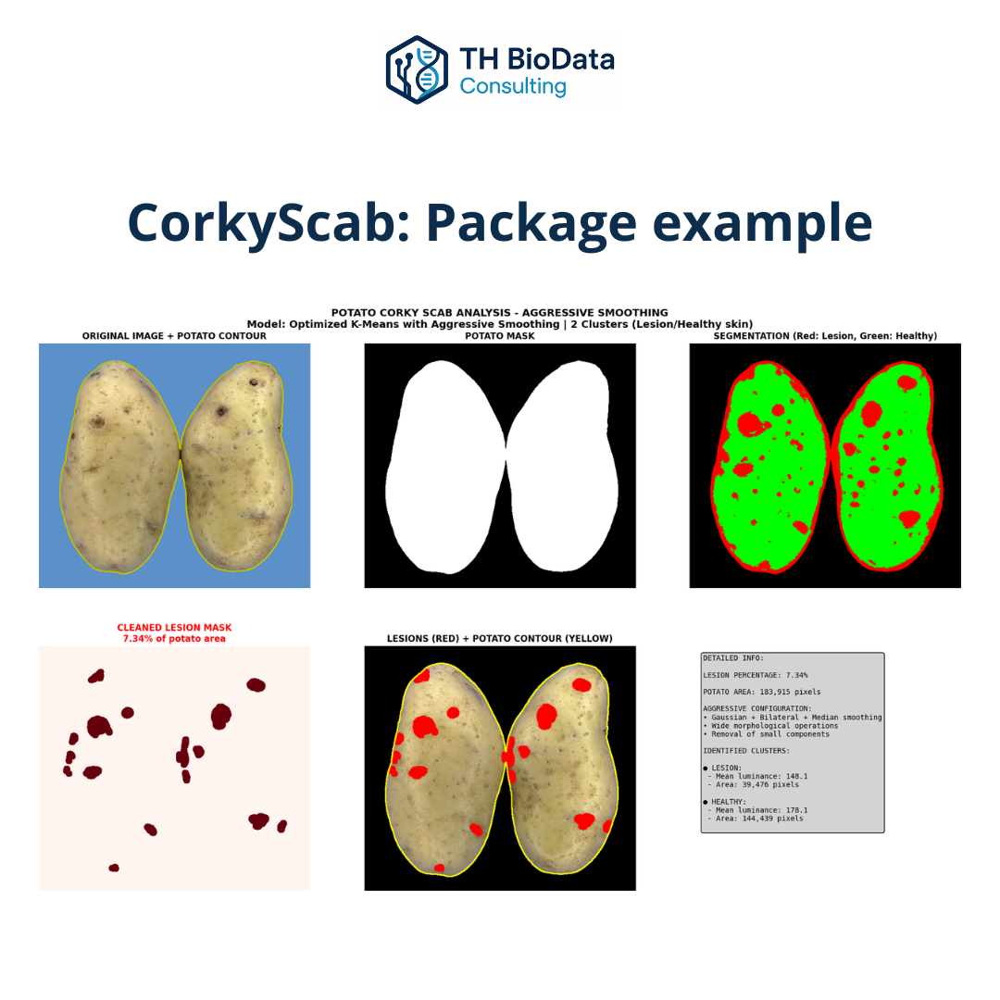

# 🥔 CorkyScab

## 🇬🇧 English
**CorkyScab** is a Python-based tool for **automated segmentation and quantification of tuber lesions** caused by *Streptomyces spp.*  
It allows researchers to assess the **extent and severity** of corky scab infections through reproducible image analysis workflows.

### Main features
- **Automatic lesion segmentation** using pixel-level thresholds and morphological filters.  
- **Quantification of lesion surface area** relative to the total tuber surface.  
- **Data export** as structured tables and processed image files.  
- **Batch processing** of multiple samples with unified outputs.  
- Designed for **laboratory and field image datasets**, ensuring robust, consistent results.

CorkyScab offers a reliable and replicable approach for quantifying plant disease symptoms, integrating seamlessly into image-based phenotyping and plant health analytics pipelines.

### 🧩 Tech stack
`Python`, `OpenCV`, `NumPy`, `Pandas`, `Matplotlib`

### 📂 Repository
🔗 [TH BioData – CorkyScab](https://github.com/TH-BioData/CorkyScab)  
📘 Documentation: https://tiagoalejoh.github.io/CorkyScab

---

## 🇪🇸 Español
**CorkyScab** es una herramienta desarrollada en Python para la **segmentación y cuantificación automática de lesiones en tubérculos** provocadas por *Streptomyces spp.*  
Permite evaluar la **superficie afectada y la severidad** de la enfermedad mediante flujos de trabajo reproducibles basados en análisis de imagen.

### Principales características
- **Segmentación automática de lesiones** mediante umbrales de color y filtros morfológicos.  
- **Cuantificación de área lesionada** en relación al área total del tubérculo.  
- **Exportación de datos** en tablas estructuradas e imágenes procesadas.  
- **Procesamiento por lotes** de múltiples muestras con salidas unificadas.  
- Diseñado para **datasets de laboratorio o campo**, con resultados consistentes y comparables.

CorkyScab aporta una herramienta **precisa, objetiva y reproducible** para la cuantificación de síntomas en patología vegetal y estudios de fenotipado por imagen.

---

> “Transforming biological complexity into clear, data-driven insight.”

---

## 📸 Package Example

{ width="800" }

*Example of lesion segmentation and quantification using CorkyScab.*
