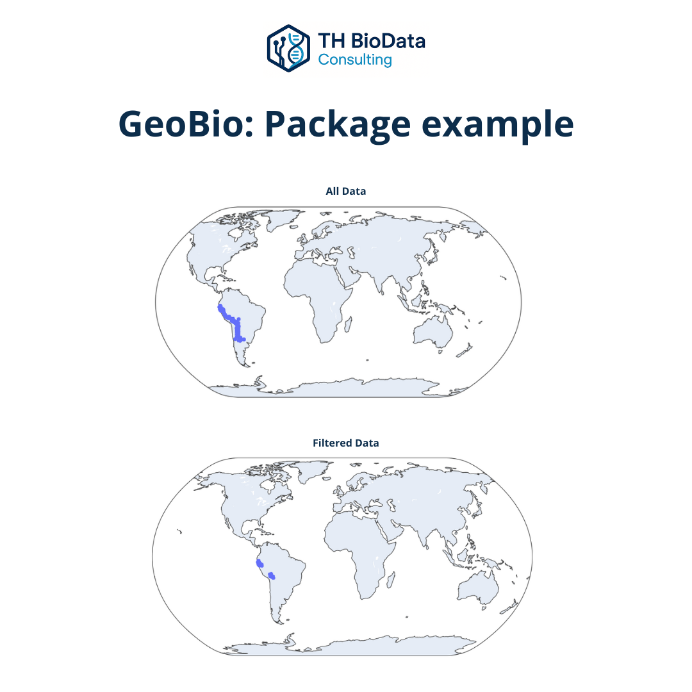

# 🌍 GeoBio

{ width="800" }

*Example of occurrence map generated with GeoBio.*

## 🇬🇧 English
**GeoBio** is a Python library designed for **ecological, biogeographical, and environmental data workflows**.  
It enables researchers and organizations to integrate species occurrence data with climatic and environmental variables, automating the extraction of CHELSA rasters and other geospatial sources.  

The package includes:
- Tools for **data cleaning and filtering** of occurrence records.  
- Extraction of **climatic variables** from raster datasets (CHELSA v2.1, WorldClim, etc.).  
- Generation of **environmental summaries** and correlation matrices.  
- Automated **visualization of species distributions** and climatic envelopes.  

These functionalities make GeoBio a versatile tool for **species distribution modeling, environmental niche analysis, and ecological data integration**, bridging biodiversity data and computational modeling.

### 🧩 Tech stack
`Python`, `GeoPandas`, `Rasterio`, `Pandas`, `Matplotlib`

### 📂 Repository
🔗 [TH BioData – GeoBio](https://github.com/TH-BioData/GeoBio)  

---

## 🇪🇸 Español
**GeoBio** es una librería de Python desarrollada para **flujos de trabajo ecológicos, biogeográficos y ambientales**.  
Permite integrar datos de ocurrencia de especies con variables climáticas y ambientales, automatizando la extracción de rasters CHELSA y otras fuentes geoespaciales.  

Incluye herramientas para:
- **Filtrado y limpieza** de registros de ocurrencia.  
- **Extracción de variables climáticas** de datasets raster (CHELSA v2.1, WorldClim, etc.).  
- **Generación de resúmenes ambientales** y matrices de correlación.  
- **Visualización automatizada** de distribuciones de especies y rangos climáticos.  

GeoBio proporciona una plataforma sólida para **modelado de distribución de especies**, **análisis de nicho ambiental** e integración reproducible de datos biológicos y geográficos.

---

> “Transforming biological complexity into clear, data-driven insight.”

---

