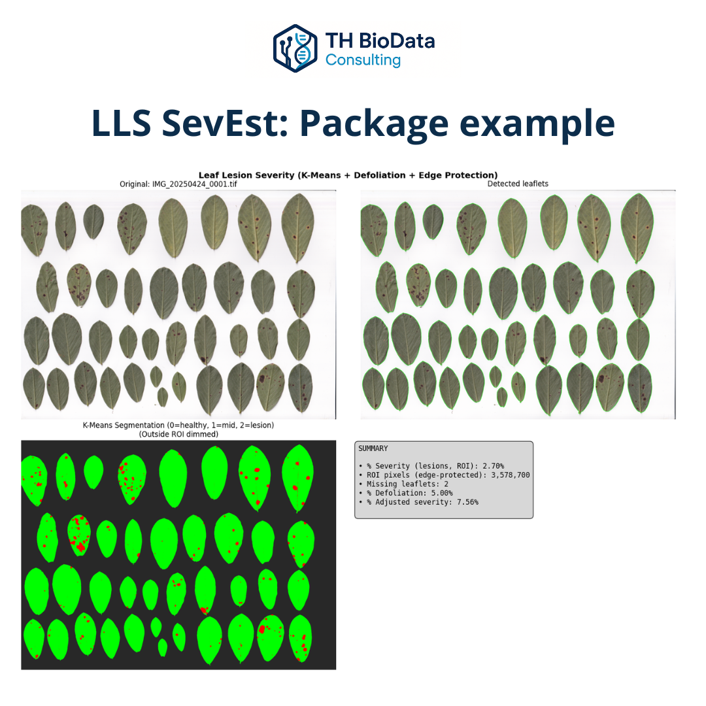

# 🍃 LLS-SevEst

{ width="800" }

*Example of lesion segmentation and defoliation-adjusted severity estimation.*

## 🇬🇧 English
**LLS-SevEst (Late Leaf Spot Severity Estimator)** is a Python package developed to **quantify the severity of leaf lesions** caused by *Nothopassalora personata* in peanut (*Arachis hypogaea*).  
It combines **K-Means image segmentation** with a **defoliation-adjustment algorithm** to calculate both lesion coverage and effective severity on each leaf sample.

**Publications:**

- Herrador, T. A. & al. 2025. [LLS-SevEst 2.0: Camino hacia una estimación más precisa de la severidad de la viruela del maní.](https://ciacabrera.com.ar/revista40/?fbclid=PAZXh0bgNhZW0CMTEAAaeFsd9JidXcBtdBx9KLZbz8Dt_7WLDQuZrMWu5EbOHVb7fdcGIOgqg-1OK3pg_aem_zTjLnvjpmCPYUP4E_Oibgg#page/46)
- Herrador, T. A. & al. 2024. [LLS-SevEst – Late leaf spot severity estimator. A machine learning approach to assessing Nothopassalora personata in peanut](https://ria.inta.gob.ar/lls-sevest-late-leaf-spot-severity-estimator-a-machine-learning-approach-to-assessing-nothopassalora-personata-in-peanut)

### Core features
- Segmentation of leaf lesions using **unsupervised clustering (K-Means)**.  
- Estimation of **percentage of affected area** per leaflet or image.  
- Correction of severity according to **leaf defoliation index**.  
- Export of **tabulated results (Excel/CSV)** and **segmented images**.  
- Optional **visualization interface** for quality control and interpretation.  

LLS-SevEst automates what traditionally requires manual assessment, providing **objective, reproducible, and scalable severity estimation** for plant pathology research and crop evaluation.

### 🧩 Tech stack
`Python`, `OpenCV`, `Scikit-learn`, `NumPy`, `Pandas`, `Matplotlib`

### 📂 Repository
🔗 [TH BioData – LLS-SevEst](https://github.com/TH-BioData/lls_sev_est)  

---

## 🇪🇸 Español
**LLS-SevEst (Late Leaf Spot Severity Estimator)** es un paquete de Python desarrollado para **cuantificar la severidad de lesiones foliares** causadas por *Nothopassalora personata* en hojas de maní (*Arachis hypogaea*).  
Combina **segmentación de imágenes por K-Means** con un **ajuste por defoliación** que permite estimar con precisión el impacto real de la enfermedad en cada muestra.

**Publicaciones:**

- Herrador, T. A. & al. 2025. [LLS-SevEst 2.0: Camino hacia una estimación más precisa de la severidad de la viruela del maní.](https://ciacabrera.com.ar/revista40/?fbclid=PAZXh0bgNhZW0CMTEAAaeFsd9JidXcBtdBx9KLZbz8Dt_7WLDQuZrMWu5EbOHVb7fdcGIOgqg-1OK3pg_aem_zTjLnvjpmCPYUP4E_Oibgg#page/46)
- Herrador, T. A. & al. 2024. [LLS-SevEst – Late leaf spot severity estimator. A machine learning approach to assessing Nothopassalora personata in peanut](https://ria.inta.gob.ar/lls-sevest-late-leaf-spot-severity-estimator-a-machine-learning-approach-to-assessing-nothopassalora-personata-in-peanut)

### Funcionalidades principales
- **Segmentación no supervisada** de lesiones mediante K-Means.  
- Cálculo del **porcentaje de superficie afectada** por hoja o imagen.  
- Ajuste de severidad considerando la **defoliación** total observada.  
- **Exportación automática** de resultados en Excel y de imágenes procesadas.  
- **Visualización interactiva** para control de calidad.  

LLS-SevEst reemplaza la evaluación manual con una metodología **objetiva, reproducible y adaptable**, optimizando el análisis de severidad en estudios fitopatológicos y programas de mejoramiento.

---

> “Transforming biological complexity into clear, data-driven insight.”

---

